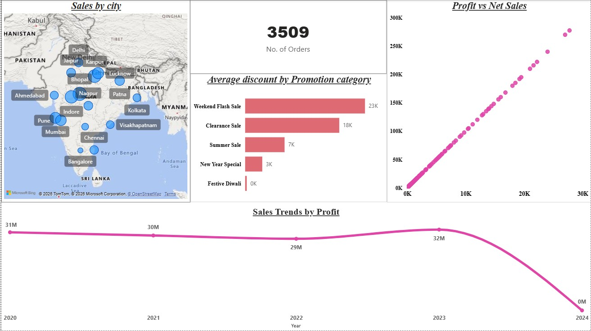
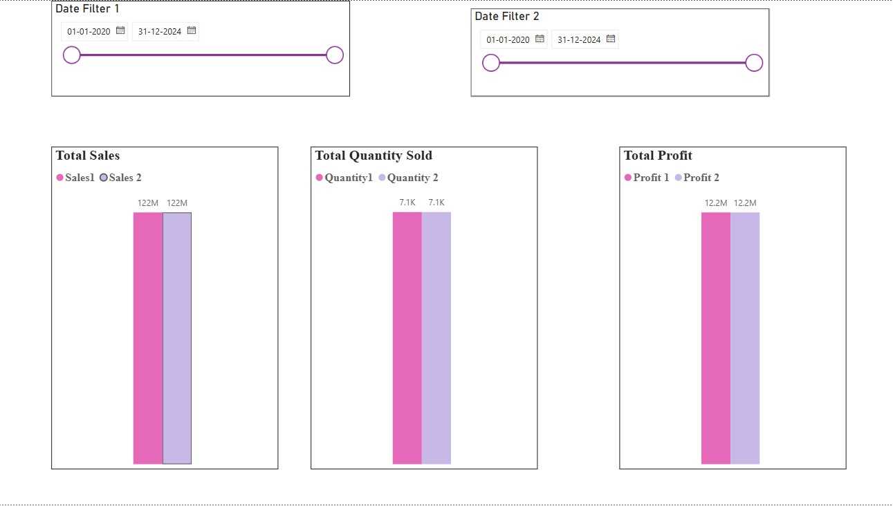
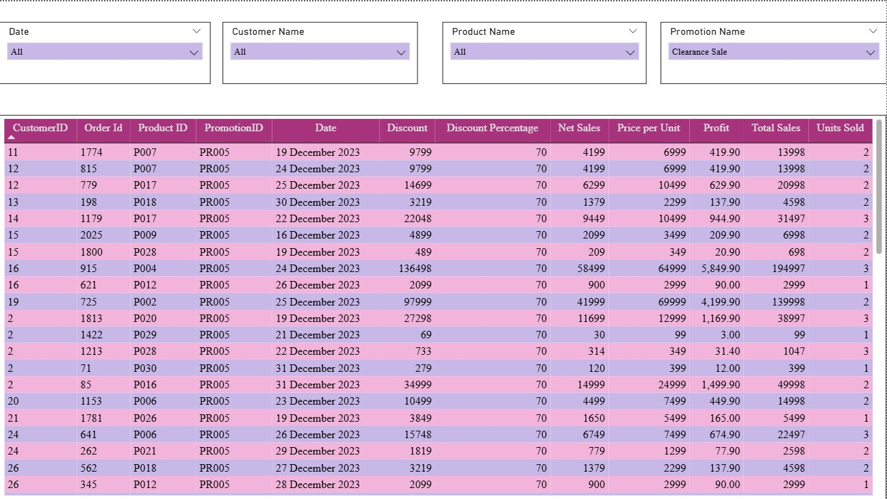

# 📊 Sales Dashboard - Power BI

## 📌 Project Overview

This Power BI Sales Dashboard provides a comprehensive analysis of sales performance, profit, quantity sold, promotions, and product performance across different cities and time periods.
The dashboard helps in understanding business trends, identifying top-performing products, and monitoring promotional impact on sales.

---

## 🎯 Objective

* Analyze total sales, profit, and quantity sold
* Compare sales performance using date filters
* Identify top and bottom performing products
* Track promotional impact on discounts
* Monitor sales trends over time
* Understand city-wise sales distribution

---

## 🛠 Tools & Technologies

* Power BI
* Excel / CSV Dataset
* Data Cleaning
* Data Modeling
* DAX
* Data Visualization

---

## 📊 Dashboard Features

### 🔹 Sales & Quantity Comparison

* Total Sales Comparison
* Total Quantity Sold
* Total Profit
* Date Filter for comparison

### 🔹 Sales Overview

* Sales by City (Map Visualization)
* Number of Orders
* Average Discount by Promotion
* Profit vs Net Sales
* Sales Trend by Profit

### 🔹 Data Table

* Customer Details
* Order Details
* Product Information
* Discount and Profit
* Sales and Units Sold

### 🔹 Product Performance

* Top 5 Products by Sales
* Bottom 5 Products by Sales
* Top 5 Products by Quantity
* Bottom 5 Products by Quantity
* Top 5 Products by Profit

---

## 📸 Dashboard Screenshots

### 📍 Overview

### 📍 Sales vs Quantity Comparison

### 📍 Table View

### 📍 Top & Bottom Products

---

## 📈 Key Insights

* Apple iPhone 14 generates highest sales and profit
* Weekend Flash Sale gives highest discount
* Sales show steady trend between 2020 and 2023
* Some products generate high quantity but low profit
* City-wise sales distribution helps identify major markets
* Promotions significantly impact sales and profit

---

## 📂 Repository Structure

Sales-Dashboard/
│
├── sales_dashboard.pbix
├── dataset.csv
├── overview.jpg
├── comparision sales vs quantity.jpg
├── table visual.jpg
├── top bottom.jpg
└── README.md

---

## 🚀 How to Use

1. Download the Power BI file (.pbix)
2. Open in Power BI Desktop
3. Load dataset if required
4. Explore dashboard and filters

---

## 👩‍💻 Author

Hemalatha S
Data Analyst | Power BI | Python | SQL
