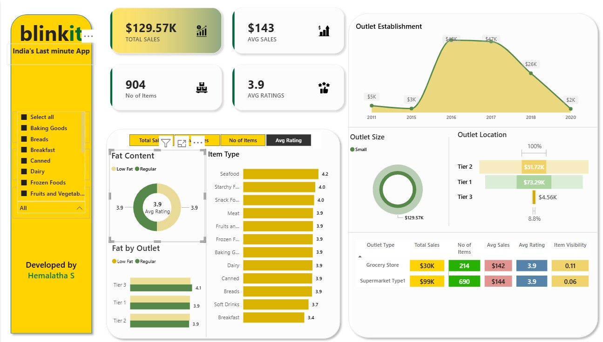

# 🛒 Blinkit Sales Analysis Dashboard (Power BI + SQL)

## 📌 Project Overview
This project analyzes Blinkit sales data to uncover insights related to product performance, outlet characteristics, and customer behavior. The dashboard is built using **Power BI**, with data processing and analysis performed using **SQL**.

---

## 🎯 Objectives
- Analyze the impact of **fat content** on total sales  
- Identify performance of **different item types**  
- Compare sales across **outlet locations and sizes**  
- Evaluate how **outlet establishment year** affects sales  
- Understand **geographical sales distribution**  
- Provide a **comprehensive KPI dashboard**  

---

## 📊 Key KPIs
- 💰 **Total Sales**
- 📈 **Average Sales**
- 📦 **Number of Items Sold**
- ⭐ **Average Rating**

---

## 🧹 Data Cleaning
Standardized inconsistent values in `Item_Fat_Content`:
- 'LF', 'low fat' → **Low Fat**
- 'reg' → **Regular**

This ensured accurate grouping and reporting.

---

## 📈 Dashboard Features

### 1. Total Sales by Fat Content
- Compares **Low Fat vs Regular** item performance

### 2. Total Sales by Item Type
- Identifies top-performing product categories

### 3. Sales by Outlet (Fat Segmentation)
- Uses **pivot analysis** to compare fat categories across locations

### 4. Sales by Outlet Establishment Year
- Shows trend of sales over time

### 5. Sales Distribution by Outlet Size
- Percentage contribution by **Small, Medium, Large outlets**

### 6. Sales by Location
- Highlights geographic performance differences

### 7. All Metrics by Outlet Type
- Combined view of KPIs for deeper insights

---

## 🛠️ Tools & Technologies
- **Power BI** → Dashboard & Visualization  
- **SQL (MS SQL Server)** → Data Cleaning & Analysis  
- **Excel/CSV** → Data Source  

---

## 📌 Key Insights
- Low Fat products contribute significantly to overall sales  
- Certain item types dominate revenue generation  
- Medium-sized outlets show strong performance  
- Sales vary notably across different locations  
---

## 📷 Dashboard Preview
*## 📷 Dashboard Preview

*

## 👩‍💻 Author
**Hemalatha Selvam**  
Aspiring Data Analyst | Power BI | SQL | Python  

---
